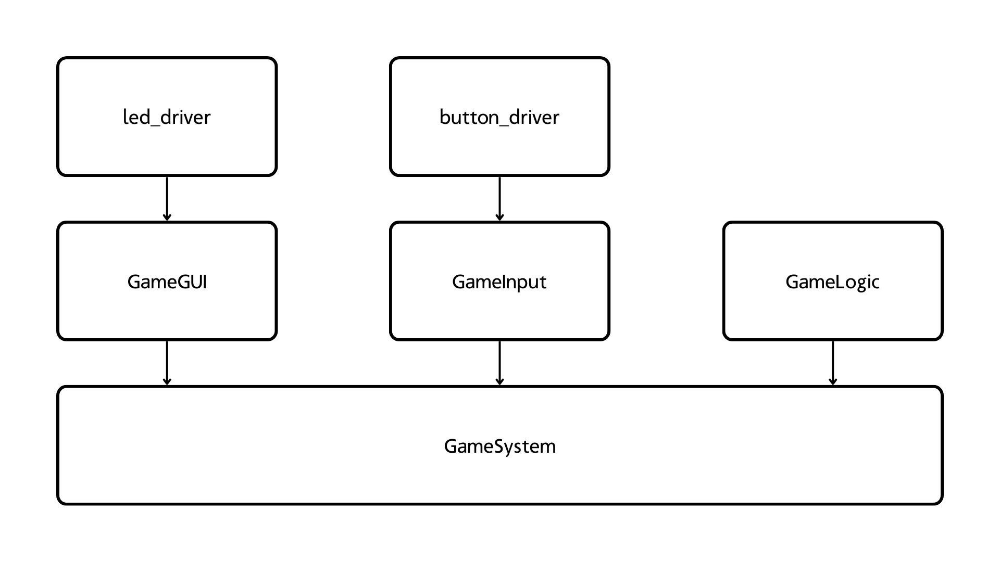

# Memory Game Challenge
You have been tasked with creating a Memory Game. The game tests the users memory, by showing a sequence of lights toggling on and off and then letting the user enter the correct order using buttons. Down below you will find a video demo, the *requirements specification* and how to properly setup the project.

* Link to video demo: https://youtu.be/fk4rhxh90CQ 
* Link to wokwi project: https://wokwi.com/projects/448275160456641537

## Requirements Specification
For this project, you have already been supplied with the drivers for the buttons and the leds. As you can see in main, this is the logic used for checking input and controlling the leds.

You can check the following files to see what public functions you are able to use:
* [led_driver.hpp](./include/led_driver.hpp)
* [button_driver.hpp](./include/button_driver.hpp)

The game can basically be divided into 4 parts:

* [**Game Logic**](#1-game-logic) - responsible for handling the underlying game logic and keeping track on your games current state.
* [**Game GUI**](#2-game-gui) - responsible for the led animation used to give feedback to the user.
* [**Game Input**](#3-game-input) - responsible for how we receieve input from the user.
* [**Game System**](#4-game-system) - the high-level implementation of our underlying classes.

### 1. Game Logic
The following logic should be applied to the game:
* Player only have 3 tries each game.
* The game only has 20 levels.
* Each level adds 2 new sequences to the game.
* Keep track of the current state.
* Handle updating state and reseting all variables to initial state.

### 2. Game GUI
The following operations should have animations:
* When turning on the device
* Showing available main menu options
* New game
* Wrong entry and game lost
* Correct entry and game won
* Highlighting the pushed LED during game

### 3. Game Input
The following three functions should be implemented:
* `wait_for_input()` - waits indefinitetly on user input
* `wait_for_input_ms(ms)` - waits for a specified time on user input or times out
* `flush()` - resets the button states.

### 4. Game System
The following functionality should be implemented:
* `run_game()` starts the game menu.
* `show_highscore()` displays the highscore in bits
* `reset_game()` resets the game
* `game_won()` specific behaviour when winning the game
* `game_lost()` specific behaviour when loosing the game
* `new_round()` utilizing the underlying game modules
* `play_game()` high level implementation of the game modules

## Module Architecture


## Setting up the project

### 1. Create a project on GitHub
Navigate to your repositories and create a new, empty public repository called `memory_game`.

### 2. Invite your group members
Invite your group members by navigating to your new repository `memory_game`. Then:
1. Go to Settings
2. Open Collaborators
3. Add your group members

### 3. Download the GitHub template
Download this repository (the same one you are reading in right now): https://github.com/lafftale1999/memory_game_template

Extract the project.

### 4. Connecting it to GitHub
Open Git Bash and navigate to the root of the project you downloaded in [step 3](#3-download-the-github-template). The path should be something like the following: `C:\Users\prett\Desktop\dev\memory_game>`

Run the following commands:

1. Initialize Git to track your repository
    ```sh
    git init
    ```

2. Connect the local repository to your GitHub repository
    ```sh
    git remote add origin <link_to_git_hub_repo>
    ```

3. Push your initial commit
    ```sh
    git add .
    ```
    ```sh
    git commit -m "initial commit"
    ```
    ```sh
    git push origin main
    ```

### 5. Inform your mentor
When you have succesfully created the project, please let your mentor look at it to avoid problems further down the line!

## Working as a team!

### 1. Split up the project into smaller parts
Instead of looking at the project as a whole, separate it into several smaller chunks. So in this project we basically have 4 moving parts - the gui, input, logic and high-level implementations through the system. Look at how these are related to each other:
* GUI
* Input
* Logic
* System (uses GUI, Input, Logic)

This should mean that you can work on GUI, Input and Logic independently without affecting eachother and when you are done - you can assemble the System using the underlying implementations.


### 2. Working with GitHub
Each member should always work on their own branch. This is achieved by doing the following:
* [2.1. Clone the project](#21-clone-the-project-if-you-dont-have-it-on-your-computer-yet)
* [2.2. Create your own branch](#22-create-your-own-branch)
* [2.3. Committing Changes](#23-committing-changes)
* [2.4. Pushing to GitHub](#24-pushing-to-github)
* [2.5. Pull requests](#25-pull-requests)

---

#### **2.1. Clone the project** (if you don't have it on your computer yet)

Cloning means downloading it to your computer. This is achieved by using the following command:

```sh
git clone <link_to_git_hub_project>
```

Then change directory to the projects root folder. This is achieved by doing

```sh
cd memory_game
```

#### **2.2. Create your own branch**

Create a branch that describes what you are working on. For example - if you are creating the `game_logic` class, then a good name for your branch would be `game_logic`. Create a new branch by using the following command:

```sh
git checkout -b game_logic
```

> Note: This will automatically switch to your new branch

#### **2.3. Committing Changes**

When you have written some functioning code, it is always good to commit - entering it into the "logbook". This is achieved by doing the following commands:

```sh
git add .
```

```sh
git commit -m "description of your functionality that you added"
```

#### **2.4. Pushing to GitHub**

When you are finished with your part, you want to push it to GitHub. Before you push it, you should always get any changes from the `main`-branch. This is achieved by doing the following:

```sh
git pull origin main
```

Then you solve some conflicts if needed. Then you commit as you did in the earlier step again.

```sh
git push origin <branch_name>
```

>**Note:** Enter the branch-name that you are working on, for example `game_logic`.

#### **2.5. Pull requests**

Once you have successfully updated your code with main and pushed it to GitHub, you can navigate to your project on GitHubs website and then choose your branch.

It will prompt you to **Contribute** and then `Open pull request`. Here you can:

* Add a title for your request
* Give a description.

Enter the information and the click `Create pull request`.

This should enable you too automatically merge your branches by clicking `Merge pull request`. Wait a couple of seconds until it's done and then click `delete branch`.

**YOU HAVE NOW SUCCESSFULLY AND SECURELY MERGED YOUR PROGRAM**
